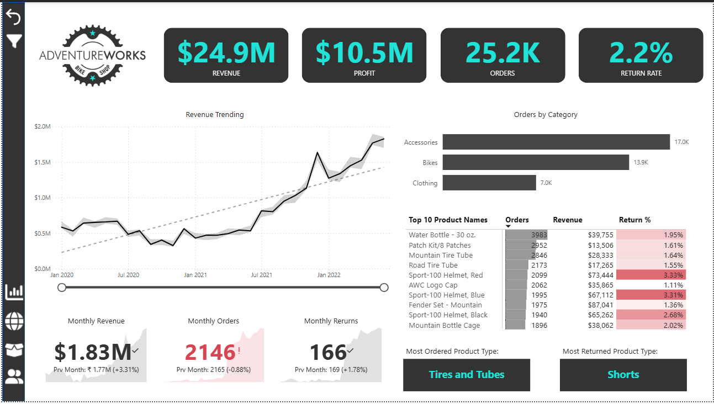
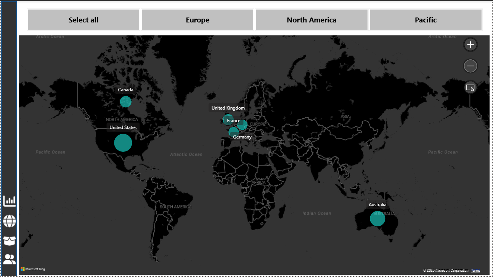
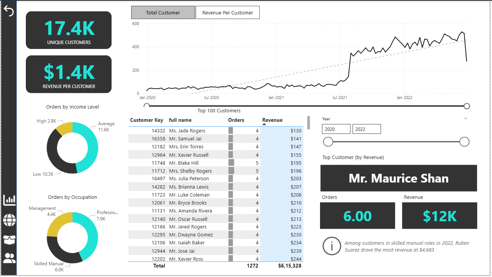
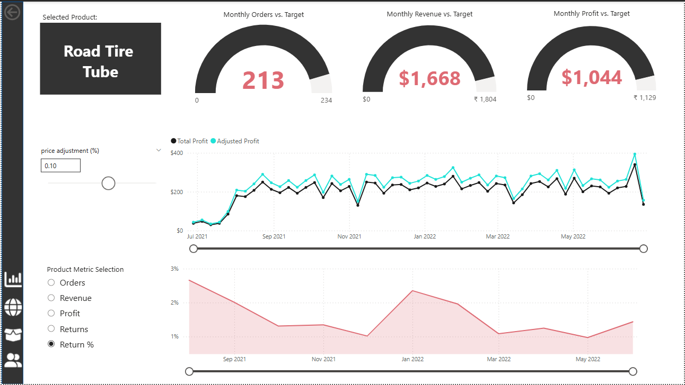

# 📊 AdventureWorks Business Insights Dashboard

---

## Recommended Structure and Order

### 1. Project Title / Headline
**AdventureWorks Business Insights Dashboard**  
An interactive Power BI report designed to monitor key performance metrics across sales, customers, products, and regions for strategic decision-making.

---

### 2. Short Description / Purpose
This dashboard provides a unified view of AdventureWorks’ business performance, enabling management to track KPIs such as revenue, profit, and returns, compare regional performance, analyze product-level trends, and identify high-value customers.

---

### 3. Tech Stack
List of key technologies used to build the dashboard:

- 📊 **Power BI Desktop** — Primary data visualization and dashboarding tool.  
- 📂 **Power Query** — Data transformation and preparation layer.  
- 🧮 **DAX (Data Analysis Expressions)** — For calculated measures, KPIs, and business logic.  
- 📝 **Data Modeling** — Fact and dimension tables linked via relationships to enable cross-filtering.  
- 📁 **File Format** — `.pbix` for development and `.png` / `.jpg` for dashboard previews.

---

### 4. Data Source
**Source:** Microsoft AdventureWorks Dataset (sample data provided by Microsoft).

Dataset includes (examples):
- **Sales Transactions** — Order details with revenue, cost, and profit.  
- **Returns Data** — Records of returned items and reasons.  
- **Products** — Product catalog with categories and attributes.  
- **Customers** — Customer demographics and income details.  
- **Sales Territories** — Regional and country-level segmentation.

---

### 5. Features / Highlights

#### • Business Problem  
Management needed a centralized reporting solution to monitor sales performance, profitability, product trends and customer segments across multiple regions.

#### • Goal of the Dashboard  
To deliver an interactive, visual reporting tool that:  
- Highlights sales and profitability KPIs.  
- Surfaces product-level performance and trends.  
- Segments customers and highlights high-value buyers.  
- Enables geographic/regional comparison and trend analysis.

#### • Walkthrough of Key Visuals (Detailed)

**Key KPIs (Top Section)**  
- KPI cards showing: **Total Sales**, **Total Revenue**, **Profit**, **Return Rate** — an executive snapshot for quick decisions.

**Regional Performance (Map + Bar Charts)**  
- Interactive map + bar charts showing sales and profit by **Territory**, **Country**, and **Region**.  
- Drill-through and slicer-enabled filters allow users to focus on specific geographies and compare performance across regions.

**Product Performance (Category & Subcategory View)**  
- Stacked bar charts and trend lines show sales, revenue, and profit by **Product Category** and **Subcategory** (e.g., Bikes, Accessories, Clothing).  
- Top/bottom lists highlight best-selling and underperforming SKUs; cross-filtering enables quick root-cause exploration.

**Customer Insights (Demographics + High-Value Customers)**  
- Segmentation visuals by **Income**, **Education**, **Occupation**.  
- High-value customers flagged by revenue contribution and purchase frequency; includes an exportable table for targeted campaigns.

**Returns Analysis (Product & Region)**  
- Return quantities, return rates, and associated cost metrics by product line and region.  
- Heatmaps / bar charts highlight problematic products or regions with high returns for quality or supply-chain follow-up.

**Product Detail Page (Drill-Through)**  
- A dedicated detail page for individual products, accessible via drill-through.  
- Displays sales trends, profit contribution, return rate, and customer demographics for the selected product.  
- Useful for managers to investigate specific SKUs and identify root causes for performance variation.

**Trend Analysis (Time-Series Charts)**  
- Line/area charts for monthly and quarterly **Sales** and **Revenue** trends.  
- Seasonal patterns, YoY growth, and rolling average lines for forecasting/monitoring.

#### • Business Impact & Insights
- 📈 Supports data-driven strategic decisions by consolidating KPIs into a single view.  
- 🌍 Identifies growth opportunities (top-performing regions) and underperforming areas.  
- 🛍️ Helps marketing & sales prioritize high-value customers and segments.  
- 📦 Improves inventory and returns management by surfacing product-level issues.

---

### 6. Screenshots / Demos
Preview images (place your screenshots in an `images/` folder):

  
*Alt: Overview of the main dashboard page showing KPIs and trend tiles.*

  
*Alt: Map and bar charts for territory-level performance.*

  
*Alt: Customer segmentation and high-value customer list.*

  
*Alt: Drill-through product detail page showing sales, profit, returns, and trends.*

---

### 7. How to open & use
1. Install **Power BI Desktop** (Windows).  
2. Download the `adventureworks_report.pbix` file from this repo.  
3. Open the `.pbix` file in Power BI Desktop.  
4. Use slicers at the top-left to filter by **Date**, **Region**, **Product Category**, and other dimensions.  
5. Right-click visuals to drill-through, export data, or view underlying rows.

---

### 8. Future improvements (optional)
- Connect the model to a live data source (DirectQuery) for real-time updates.  
- Add predictive analytics using time-series forecasting or Azure ML integration.  
- Implement row-level security (RLS) for role-based dashboard access.  
- Publish to Power BI Service and create dashboard subscriptions/alerts.
